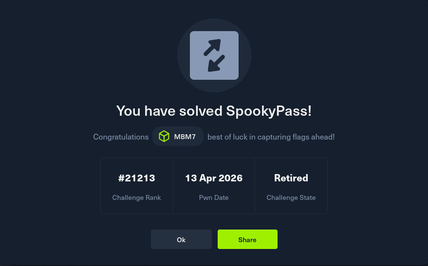

# SpookyPass - Reverse Engineering Challenge

## 🧠 Overview
Binary challenge where the goal is to find the correct password and gain access.

---

## 🔍 Static Analysis

Using `strings` on the binary, a hardcoded password was found:

s3cr3t_p455_f0r_gh05t5_4nd_gh0ul5

## 💥 Exploitation

Run the binary:

```bash
./pass
```

## 🎉 Result

```
Welcome to the SPOOKIEST party of the year.
Before we let you in, you'll need to give us the password:

s3cr3t_p455_f0r_gh05t5_4nd_gh0ul5

Welcome Inside!
```

## 🏁 Flag:

```
HTB{un0bfu5c4t3d_5tr1ng5}
```


